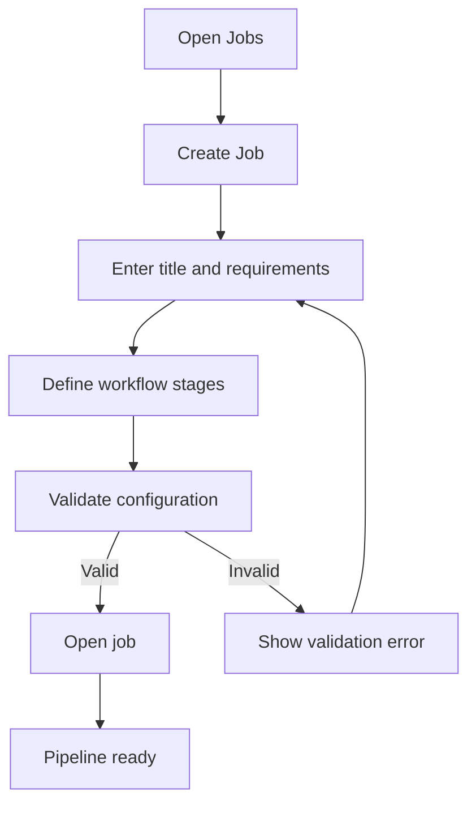
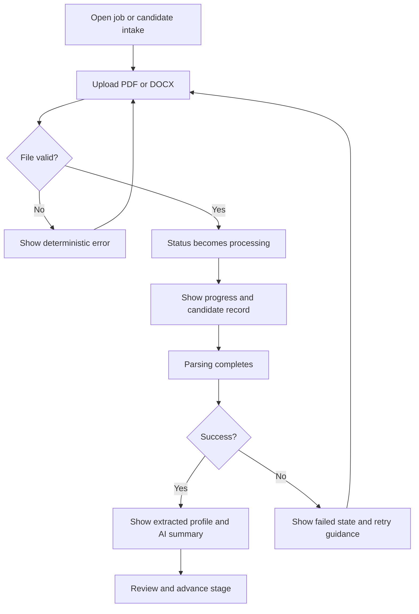
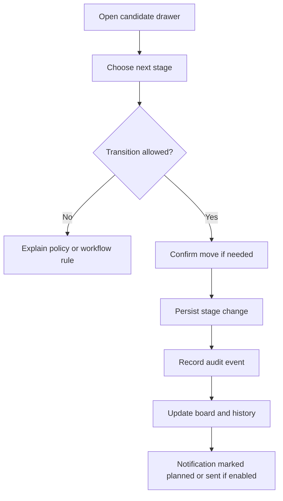
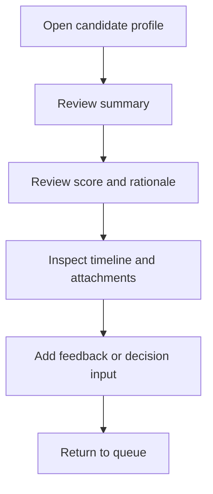
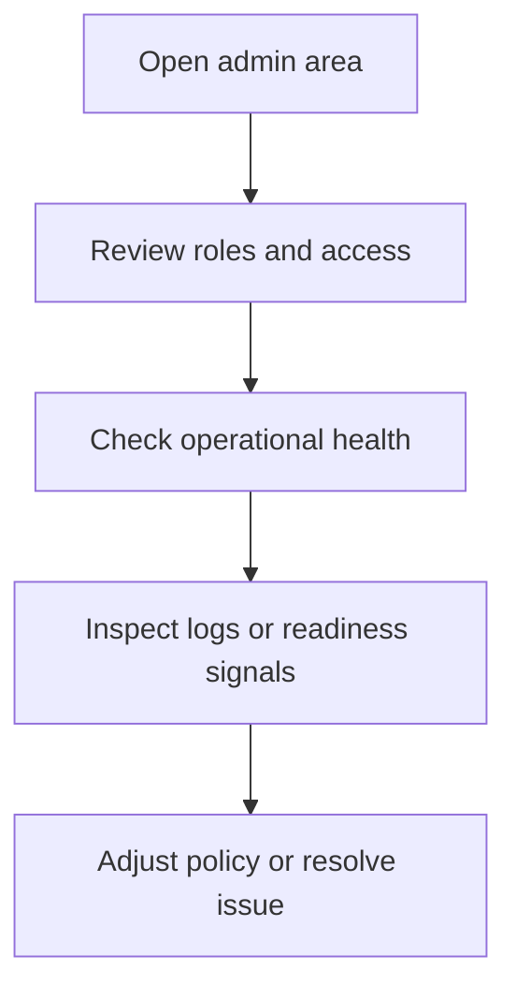

# UX Design Specification TalentFlow AI Backend

**Author:** VuongNguyen
**Date:** 2026-04-18

---

## Executive Summary

### Project Vision

TalentFlow AI should feel like a calm, efficient command center for recruiting work. The experience needs to help recruiters move from raw CV intake to a structured hiring decision with less manual review, less uncertainty, and clearer control over every stage.

### Target Users

- Recruiters: primary users who create jobs, review candidates, triage CVs, and move applications through the workflow.
- Hiring Managers and Interviewers: secondary users who review candidate context, add feedback, and support decisions.
- Admins: operational users who manage access, governance, and troubleshooting.
- External applicants: limited public-facing users for the apply and upload entry points.

### Key Design Challenges

- Dense ATS workflows need to stay fast without becoming overwhelming.
- Async CV processing must remain visible and trustworthy at every stage.
- Role-based access must be obvious without exposing internal policy details.
- Validation and error feedback must be immediate, specific, and accessible.
- Planned-only notification flows must be clearly distinguished from live runtime behavior.

### Design Opportunities

- AI extraction and scoring can reduce manual triage effort when presented clearly.
- A board plus detail-drawer layout can keep action and context together.
- Strong status language can make background processing feel predictable.
- Consistent audit and feedback patterns can build trust across the workflow.

---

## Core User Experience

### Defining Experience

The defining experience is reviewing a candidate and moving them through the pipeline with confidence while the system handles intake, parsing, scoring, and audit logging in the background. If this feels effortless, the rest of the product will feel coherent.

### User Mental Model

Users think in jobs, candidates, stages, notes, and decisions. They do not think in queue names, storage keys, or event payloads, so the interface needs to translate system state into work state.

### Success Criteria

- A recruiter can understand candidate state and decide what to do next from one screen.
- Async processing is always visible and never ambiguous.
- Stage changes are clear, auditable, and reversible where appropriate.
- Unauthorized actions are hidden or disabled with a clear explanation.
- Errors explain what happened and how to recover.

### Novel UX Patterns

This product does not need novel interaction patterns. It should combine proven enterprise patterns in a way that keeps recruiting work fast and reliable:

- workflow board or list
- right-side detail drawer
- inline validation and status chips
- AI insight card or status rail
- audit timeline

### Experience Mechanics

1. Recruiter opens a job or candidate queue.
2. Recruiter uploads a CV or opens an existing candidate record.
3. The system validates input and moves the record into processing.
4. The system shows extracted profile data, fit score, and summary when ready.
5. Recruiter reviews the result, adds notes, and moves the candidate forward.
6. The system records the change and keeps state visible.

### Platform Strategy

The product should be designed as a web-first desktop experience because the core work is data-dense and context-heavy. Tablet usage should preserve the same structure with simplified navigation, and mobile should support quick review, status checks, and lightweight actions rather than full workflow management.

### Effortless Interactions

- CV upload should use a simple dropzone plus file picker.
- Candidate stage movement should be fast and obvious.
- Filters should persist so users do not lose context.
- Notes should autosave or clearly confirm save success.
- AI summaries should appear where users already expect to review the candidate.

### Critical Success Moments

- CV upload is accepted immediately and enters processing.
- The candidate summary appears with no confusion about current state.
- A stage move succeeds and the board updates predictably.
- A permission denial explains why the action is blocked.
- A failure state provides a clear next step.

### Experience Principles

- Clarity over decoration.
- Visibility over hidden automation.
- One primary action per view.
- Human control for sensitive or irreversible actions.
- Accessible by default.

---

## Desired Emotional Response

### Primary Emotional Goals

Users should feel calm, confident, efficient, and in control. The interface should reduce mental load rather than add to it.

### Emotional Journey Mapping

- First visit: organized and understandable.
- During work: guided and reliable.
- After completion: accomplished and ready for the next action.
- When something fails: supported instead of blocked.
- When returning later: familiar and predictable.

### Micro-Emotions

- Confidence over confusion.
- Trust over skepticism.
- Accomplishment over frustration.
- Relief over anxiety.
- Focus over distraction.

### Design Implications

- Use a restrained palette and avoid visual noise.
- Keep status language explicit and consistent.
- Surface progress and recovery actions early.
- Break complex work into progressive disclosure steps.
- Keep errors actionable instead of technical.

### Emotional Design Principles

- Reassure with visible state.
- Keep the interface calm under load.
- Celebrate completion lightly.
- Never make the user guess what the system is doing.

---

## UX Pattern Analysis & Inspiration

### Inspiring Products Analysis

This product should borrow proven patterns from enterprise workflow tools such as Linear, Asana, Airtable, and Stripe-style dashboards. The key lesson is that dense work can still feel fast and understandable when hierarchy, filtering, and detail management are done well.

### Transferable UX Patterns

- Persistent left navigation for primary modules.
- Board or table views for scanning large lists.
- Right-side detail drawers for deep context without losing place.
- Filter chips for visible and removable query state.
- Timeline patterns for audit and history.
- Status chips for compact, readable state communication.
- Keyboard-friendly navigation for power users.

### Anti-Patterns to Avoid

- Hidden async work with no visible state.
- Modal overload for routine actions.
- Permission errors without recovery guidance.
- Color-only communication for status and warnings.
- Dense screens without hierarchy.
- Copy that feels technical instead of human.

### Design Inspiration Strategy

Adopt the speed and structure of enterprise workflow tools, adapt them for ATS-specific density, and avoid consumer-style ornamentation. The product should feel disciplined, not flashy.

---

## Design System Foundation

### 1.1 Design System Choice

Use a themeable enterprise system built on a mature accessible component library.

### Rationale for Selection

- The product needs tables, forms, drawers, tags, and status patterns more than highly custom visual expression.
- A mature base system reduces risk and speeds delivery.
- Themeability keeps the UI flexible without rebuilding every primitive.
- Accessible defaults matter because the interface depends on dense workflows and frequent state changes.

### Implementation Approach

- Use the library for primitives such as buttons, inputs, selects, tables, modals, drawers, tabs, alerts, and pagination.
- Build custom composites only where the ATS workflow needs domain-specific behavior.
- Centralize design tokens for color, spacing, radius, typography, and motion.
- Keep the same component language across list, board, and detail views.

### Customization Strategy

- Use a calm enterprise palette.
- Keep spacing dense enough for productivity but not cramped.
- Reserve strong accents for state and action, not decoration.
- Favor square-to-soft geometry with limited visual flourish.
- Make the whole system feel dependable rather than trendy.

---

## Visual Design Foundation

### Color System

No existing brand guidelines were provided, so the color system should be generated from product goals.

| Role | Usage | Direction |
|---|---|---|
| Primary | Main actions, links, active states | Deep blue or indigo |
| Secondary | AI insights and supporting emphasis | Teal or cyan |
| Background | App shell and surfaces | Neutral slate or gray |
| Success | Completed or approved states | Green |
| Warning | Needs attention or pending review | Amber |
| Error | Failed, blocked, or invalid states | Red |
| Info | Neutral system messages and hints | Blue |

Guidelines:

- Keep contrast at WCAG AA or better.
- Never rely on color alone to communicate status.
- Use semantic colors consistently across chips, banners, buttons, and alerts.
- Keep background and surface colors quiet so data remains the focus.

### Typography System

- Primary typeface: Inter or an equivalent modern sans-serif.
- Fallback: system sans-serif.
- Use semibold headings and regular body text.
- Keep numbers readable with tabular or aligned numeric styling.
- Prefer compact but readable line lengths for dense ATS screens.

Suggested hierarchy:

- H1: 30px / 36px
- H2: 24px / 32px
- H3: 20px / 28px
- Body: 16px / 24px
- Supporting text: 14px / 20px
- Meta text: 12px / 16px

### Spacing & Layout Foundation

- Base spacing grid: 8px.
- Fine adjustments: 4px.
- Standard component spacing: 16px.
- Section spacing: 24px to 32px.
- Layout should favor a persistent left navigation, a top context bar, and a main content area with optional right-side detail panel on desktop.
- Candidate and application views should support dense scanning without feeling cluttered.

### Accessibility Considerations

- Maintain strong contrast for text, icons, and status chips.
- Ensure visible focus states throughout the interface.
- Keep touch targets at or above 44x44px.
- Use text plus icon plus color for important status changes.
- Announce processing and error updates to assistive technologies.

---

## Design Direction Decision

### Design Directions Explored

1. Command center layout for dense operational work.
2. Candidate story layout focused on profile narrative.
3. Minimal workflow layout with fewer controls.
4. AI spotlight layout that prioritizes scoring and insights.
5. Dense operations layout optimized for power users.
6. Hybrid board plus drawer layout that combines scanning and detail review.

### Chosen Direction

Operational Command Center with Guided AI Highlights.

### Design Rationale

- Supports high-volume recruiting work.
- Keeps candidate context close to the action.
- Makes AI output visible without taking over the interface.
- Balances speed, structure, and trust.
- Fits the product’s role-based, audit-heavy workflow.

### Implementation Approach

- Use a persistent navigation shell.
- Combine board and list views where density matters.
- Keep candidate detail in a sticky drawer or secondary panel.
- Surface AI summary, score, and audit information together.
- Treat processing state as a first-class part of the interface.

---

## User Journey Flows

### Recruiter Creates a Job Pipeline

Recruiters need to create a job, define the workflow stages, and open the pipeline for intake.

Flow notes:

- Keep the stage builder structural and simple.
- Show validation at the point of entry.
- Preserve draft state if the recruiter needs to step away.

### Recruiter Uploads CV and Reviews AI Triage

This is the core MVP journey.

Flow notes:

- The processing state must appear immediately.
- The user should never wonder if the upload worked.
- The summary should present score, strengths, gaps, and extracted fields together.

### Recruiter Moves Candidate and Triggers Communication

Flow notes:

- Block or hide invalid transitions.
- Keep the audit trail visible.
- Treat notification outcomes as conditional until runtime support exists.

### Hiring Manager Evaluates Candidate in One View

Flow notes:

- Present the most important information first.
- Keep supporting context below the fold or in tabs.
- Make feedback capture quick and low friction.

### Admin Governs Security and Operations

Flow notes:

- Keep operational controls separate from day-to-day recruiting work.
- Surface only the actions that the role can actually perform.
- Link troubleshooting paths to health, readiness, and documentation.

### Deferred Growth Journeys

The following journeys are part of the product direction but are not the focus of the MVP UX spec:

#### UJ-06: Automation Source Submits CV Intake

- Mark as future/conditional.
- Use a protected ingestion boundary.
- Keep conflict resolution and idempotency visible, but defer detailed UI design.

#### UJ-07: Owner Purchases and Activates a Plan

- Mark as future/conditional.
- Support eligible owner-context plan selection, migration, and payment state changes later.

#### UJ-08: Business Workspace Member Uses Shared Capabilities

- Mark as future/conditional.
- Support workspace entitlements and quota-aware actions in a later release.

### Journey Patterns

- Enter through a job, candidate, or admin context.
- Preserve context while drilling into detail.
- Make background work visible through status rails and chips.
- Keep transitions auditable.
- Use progressive disclosure for complex screens.

### Flow Optimization Principles

- Minimize steps to value.
- Keep validation close to the point of entry.
- Never hide background state.
- Preserve list context when opening detail.
- Make recovery paths obvious.

---

## Component Strategy

### Design System Components

Use the design system for the following foundation components:

| Component | Use |
|---|---|
| Button | Primary and secondary actions |
| Input and Textarea | Forms and notes |
| Select and Autocomplete | Stage, role, and filter selection |
| Table | Job, candidate, and application lists |
| Tabs | Candidate detail sections |
| Modal | Confirmations and destructive actions |
| Drawer | Candidate detail and workflow review |
| Alert | Validation and system messages |
| Badge and Tag | Status and labels |
| Timeline | Audit and activity history |
| Pagination | List navigation |
| Skeleton | Loading states |
| Progress | Async processing state |
| Upload | CV intake |
| Tooltip | Dense interface explanations |

### Custom Components

#### Candidate Fit Summary Card

- Purpose: show score, top matches, and gaps in one compact area.
- States: loading, ready, partial, failed.
- Accessibility: heading structure plus readable score label, not color alone.

#### CV Processing Status Rail

- Purpose: keep async intake visible from upload through completion.
- States: processing, parsed, failed, retryable.
- Accessibility: live updates and clear text status.

#### Candidate Detail Drawer

- Purpose: keep primary list context visible while reviewing a candidate.
- States: open, loading, error, empty.
- Accessibility: focus trap, close button, and keyboard escape support.

#### Application Stage Board

- Purpose: support fast scanning and stage movement.
- States: empty, populated, filtering, drag or select move.
- Accessibility: keyboard alternative to drag interaction.

#### Validation Summary Panel

- Purpose: summarize form or upload issues at the top of the screen.
- States: hidden, error, warning, success.
- Accessibility: anchored summary with linked field errors.

#### Permission Gate Banner

- Purpose: explain why an action is unavailable.
- States: hidden, denied, limited access.
- Accessibility: plain language, no hidden policy jargon.

#### Audit Timeline

- Purpose: show important changes and history in chronological order.
- States: compact, expanded, empty.
- Accessibility: readable timestamps and clear event labels.

#### AI Insight Chips

- Purpose: highlight matched keywords, strengths, and gaps.
- States: neutral, positive, caution, loading.
- Accessibility: text labels in addition to color.

### Component Implementation Strategy

- Build custom components from shared tokens and primitives.
- Keep variants minimal and consistent.
- Reuse the same status vocabulary across views.
- Make every custom component keyboard accessible.
- Keep dangerous actions behind confirmations when needed.

### Implementation Roadmap

#### Phase 1 - Core Components

- App shell and navigation.
- Forms, inputs, and validation patterns.
- Upload flow and processing state.
- Status chips, alerts, and skeletons.

#### Phase 2 - Workflow Components

- Candidate detail drawer.
- Application stage board.
- AI summary card.
- Audit timeline.

#### Phase 3 - Enhancement Components

- Advanced filters.
- Better comparison and review aids.
- Growth-scope surfaces such as future notification and entitlement views.

---

## UX Consistency Patterns

### Button Hierarchy

- One primary action per view.
- Secondary actions should never compete with the main task.
- Destructive actions must be visually separated and clearly labeled.
- Icon-only buttons need accessible labels.

### Feedback Patterns

- Use inline validation for field-level issues.
- Use a page-level summary for multi-field errors.
- Use toasts only for non-blocking success or background completion.
- Use persistent banners or rails for async processing.
- Announce important state changes to assistive technologies.

### Form Patterns

- Put labels above fields.
- Preserve user input when submission fails.
- Show helper text before the user makes a mistake.
- Disable submit only when the form is structurally invalid.
- Keep error messages specific and actionable.

### Navigation Patterns

- Left navigation for primary modules.
- Breadcrumbs for detail pages.
- Tabs inside candidate and job detail views.
- Filter chips above lists so the current query is visible.
- Board/list toggle where the user needs both scanning and detail review.

### Error Catalog

| Error class | When it appears | User-facing message direction | Recovery |
|---|---|---|---|
| Validation | Missing or invalid input | Tell the user exactly what to fix | Edit the field and resubmit |
| Session expired | Auth cookie no longer valid | Ask the user to sign in again | Re-authenticate |
| Permission denied | Role or workspace policy blocks action | Explain the action is unavailable for this account | Contact admin or switch context |
| Upload rejected | Unsupported file type, size, or signature | State the file requirements clearly | Choose a valid file |
| Async failure | Parsing or downstream processing fails | Say the candidate is not ready yet and why | Retry or review the failed state |
| Conflict or not found | Item changed or no longer exists | Explain the item is no longer available | Refresh or reopen from the list |

### Additional Patterns

- Loading states should use skeletons and visible progress.
- Empty states should explain what to do next.
- Confirmation dialogs should be used for destructive actions only.
- Future notification surfaces should be labeled planned until the runtime exists.
- Keep status labels consistent across tables, drawers, timelines, and banners.

---

## Responsive Design & Accessibility

### Responsive Strategy

The experience should be optimized for desktop first because recruiting work is highly visual and multi-panel. Tablet should collapse the layout without losing context, and mobile should prioritize quick review, status checks, and lightweight actions.

### Breakpoint Strategy

Use standard breakpoints:

- Mobile: below 768px
- Tablet: 768px to 1023px
- Desktop: 1024px and above
- Wide desktop: 1440px and above

Layout behavior:

- Desktop: full shell, multi-column content, persistent detail drawer.
- Tablet: reduced density, collapsible navigation, simpler split panels.
- Mobile: stacked sections, full-screen detail views, board-to-list fallback.

### Accessibility Strategy

- Target WCAG AA.
- Support keyboard-only navigation for all primary flows.
- Preserve visible focus indicators across every interactive element.
- Use ARIA live regions for async processing updates and critical messages.
- Keep color from being the only state signal.
- Ensure touch targets remain comfortably tappable.

### Testing Strategy

- Test on real desktop and mobile devices.
- Validate keyboard navigation end to end.
- Test with screen readers.
- Check color contrast and status readability.
- Verify loading, error, and empty states, not just success paths.

### Implementation Guidelines

- Use semantic HTML.
- Prefer relative units over fixed sizes where practical.
- Keep tab order logical.
- Trap focus in dialogs and drawers.
- Preserve scroll position when returning from detail views.
- Announce processing, success, and failure states in plain language.
- Avoid layout changes that hide critical information on smaller screens.

---

## Supporting Visual Assets

- Color themes visualizer: `_bmad-output/planning-artifacts/ux-color-themes.html`
- Design directions showcase: `_bmad-output/planning-artifacts/ux-design-directions.html`

---

## Completion Notes

This specification is focused on the MVP scope. Growth journeys and planned notification behavior are documented as deferred or conditional so the UX stays aligned with current backend reality.
