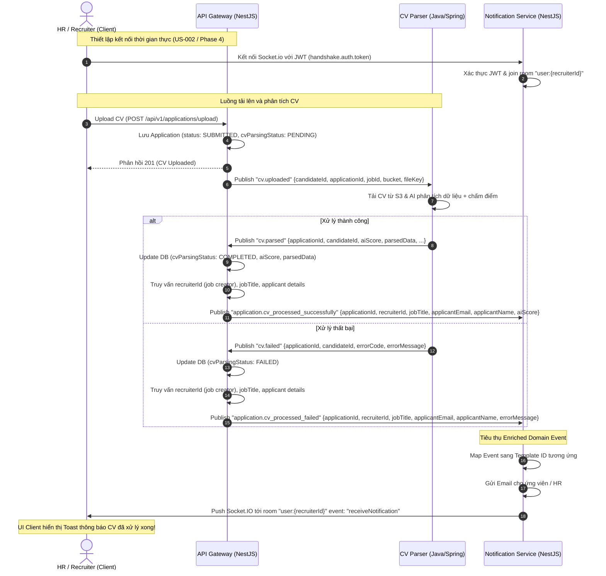

# Tài liệu Thiết kế & Giao ước Sự kiện (Event Contract): CV Parsing Notifications

**Mục tiêu**: Định hình lại luồng giao tiếp dữ liệu bất đồng bộ (event-driven workflow) cho các sự kiện phân tích CV (`cv.parsed` và `cv.failed`). Thiết kế này sử dụng `api-gateway` làm Orchestrator/Enricher để giải quyết lỗ hổng dữ liệu ngữ cảnh (Context Data Deficit), đồng thời tích hợp Socket.IO (liên kết đến **Phase 4 - Socket.IO Real-time** và **User Story US-002**) để push notification thời gian thực tới HR/Recruiter.

---

## 1. Kiến trúc luồng xử lý (Workflow Architecture)

Do `cv-parser` chạy nền cô lập, nó không thể truy cập trực tiếp Postgres DB của `api-gateway` và không biết thông tin ngữ cảnh nghiệp vụ (Ai đã tải CV lên? Job title là gì?).

Giải pháp áp dụng **"Enriched Domain Event" thông qua `api-gateway`**:
1. `cv-parser` hoàn thành phân tích và gửi sự kiện thô kèm ID (`applicationId`, `jobId`, `candidateId`, `aiScore`/`errorMessage`).
2. `api-gateway` tiêu thụ các sự kiện thô này. Nó cập nhật Database (lưu trữ kết quả phân tích và thay đổi trạng thái kỹ thuật `cvParsingStatus`).
3. `api-gateway` truy vấn thông tin HR (`recruiterId`), `jobTitle`, và thông tin ứng viên để tạo thành một sự kiện nghiệp vụ đã được làm giàu (Enriched Domain Event).
4. `api-gateway` phát các sự kiện nghiệp vụ (`application.cv_processed_successfully` hoặc `application.cv_processed_failed`) sang cho `notification` service.
5. `notification` service lắng nghe các sự kiện này, tự quyết định template nội dung, và vừa gửi email cho ứng viên (nếu cần), vừa đẩy thông báo qua Socket.IO phòng `user:{recruiterId}` cho HR đang trực tuyến.

### Sơ đồ luồng (Workflow Sequence Diagram)



---

## 2. Chi tiết Giao ước Dữ liệu (Contract Specification)

### 2.1. Sự kiện Raw: `cv.parsed` (Publisher: `cv-parser` -> Consumer: `api-gateway`)
Sự kiện phát đi từ worker sau khi phân tích thành công.

*   **Routing Key**: `cv.parsed`
*   **Exchange**: `talentflow.events` (Topic)
*   **Payload Schema (JSON)**:
```json
{
  "candidateId": "9b1deb4d-3b7d-4bad-9bdd-2b0d7b3dcb6d",
  "applicationId": "1a2b3c4d-5e6f-7a8b-9c0d-1e2f3a4b5c6d",
  "jobId": "f47ac10b-58cc-4372-a567-0e02b2c3d479",
  "aiScore": 85,
  "parsedData": {
    "fullName": "Nguyễn Văn A",
    "email": "nguyenvana@example.com",
    "skills": ["Node.js", "NestJS", "PostgreSQL"],
    "experience": [...],
    "education": [...]
  },
  "scoringReasoning": "Strong match in NestJS and Postgres database design.",
  "parsedAt": "2026-06-16T14:30:00Z"
}
```

### 2.2. Sự kiện Raw: `cv.failed` (Publisher: `cv-parser` -> Consumer: `api-gateway`)
Sự kiện phát đi khi phân tích thất bại.

*   **Routing Key**: `cv.failed`
*   **Exchange**: `talentflow.events` (Topic)
*   **Payload Schema (JSON)**:
```json
{
  "candidateId": "9b1deb4d-3b7d-4bad-9bdd-2b0d7b3dcb6d",
  "applicationId": "1a2b3c4d-5e6f-7a8b-9c0d-1e2f3a4b5c6d",
  "jobId": "f47ac10b-58cc-4372-a567-0e02b2c3d479",
  "errorCode": "EXTRACTION_FAILED",
  "errorMessage": "Unable to extract text from the provided CV document.",
  "retryable": false,
  "failedAt": "2026-06-16T14:31:00Z"
}
```

---

### 2.3. Sự kiện Enriched: `application.cv_processed_successfully` (Publisher: `api-gateway` -> Consumer: `notification`)
Sự kiện nghiệp vụ (Domain Event) được phát đi từ `api-gateway` sau khi lưu DB thành công.

*   **Routing Key**: `application.cv_processed_successfully`
*   **Exchange**: `talentflow.events` (Topic)
*   **Payload Schema (JSON)**:
```json
{
  "applicationId": "1a2b3c4d-5e6f-7a8b-9c0d-1e2f3a4b5c6d",
  "recruiterId": "uuid-cua-recruiter",
  "jobTitle": "Kỹ sư Node.js",
  "applicantEmail": "nguyenvana@example.com",
  "applicantName": "Nguyễn Văn A",
  "aiScore": 85,
  "timestamp": "2026-06-16T14:30:05Z"
}
```

### 2.4. Sự kiện Enriched: `application.cv_processed_failed` (Publisher: `api-gateway` -> Consumer: `notification`)

*   **Routing Key**: `application.cv_processed_failed`
*   **Exchange**: `talentflow.events` (Topic)
*   **Payload Schema (JSON)**:
```json
{
  "applicationId": "1a2b3c4d-5e6f-7a8b-9c0d-1e2f3a4b5c6d",
  "recruiterId": "uuid-cua-recruiter",
  "jobTitle": "Kỹ sư Node.js",
  "applicantEmail": "nguyenvana@example.com",
  "applicantName": "Nguyễn Văn A",
  "errorMessage": "Unable to extract text from the provided CV document.",
  "timestamp": "2026-06-16T14:31:05Z"
}
```

---

## 3. Kế hoạch triển khai mã nguồn (Implementation Plan)

### Bước 1: Cập nhật Database Schema (`api-gateway`)
1.  **Tách biệt trạng thái**: Bổ sung enum `CvParsingStatus` (`PENDING`, `PROCESSING`, `COMPLETED`, `FAILED`). Điều này giúp tách biệt trạng thái kỹ thuật phân tích file với trạng thái quy trình tuyển dụng (`ApplicationStatus: SUBMITTED, REVIEWING...`).
2.  Bổ sung các field vào model `Application`:
    *   `cvParsingStatus CvParsingStatus @default(PENDING)`
    *   `aiScore Float?`
    *   `scoringReasoning String?`
    *   `parsedData Json?`

### Bước 2: Triển khai Consumer và Orchestrator tại `api-gateway`
1.  Đăng ký hàng đợi đón nhận sự kiện `cv.parsed` và `cv.failed`.
2.  Tạo Service Listener tiêu thụ các event này:
    *   **Thành công**: Cập nhật `cvParsingStatus` thành `COMPLETED`, lưu `aiScore`, `scoringReasoning`, `parsedData`. Mở giao dịch (Transaction) lấy thông tin Job (`recruiterId`, `jobTitle`) và Candidate. Phát sự kiện `application.cv_processed_successfully`.
    *   **Thất bại**: Cập nhật `cvParsingStatus` thành `FAILED`. Lấy thông tin tương tự và phát sự kiện `application.cv_processed_failed`.

### Bước 3: Cập nhật logic dịch vụ `notification`
1.  **HỦY BỎ** việc lắng nghe trực tiếp `cv.parsed` và `cv.failed` (dành cho API Gateway xử lý).
2.  Đăng ký lắng nghe Domain Events: `application.cv_processed_successfully` và `application.cv_processed_failed`.
3.  Khi nhận event, `notification` service có nhiệm vụ:
    *   **Bản địa hóa thông báo**: Dựa vào event type để tự map ra `templateId` cho Email hoặc nội dung text cho Toast notification. (VD: `application.cv_processed_successfully` -> Chọn Email Template báo CV đã nộp thành công & chấm điểm xong).
    *   **Gửi Email**: Qua SMTP Service.
    *   **Push Socket.IO**: Thông qua `NotificationGateway.sendToUser(event.recruiterId, 'receiveNotification', { ...data })`.
