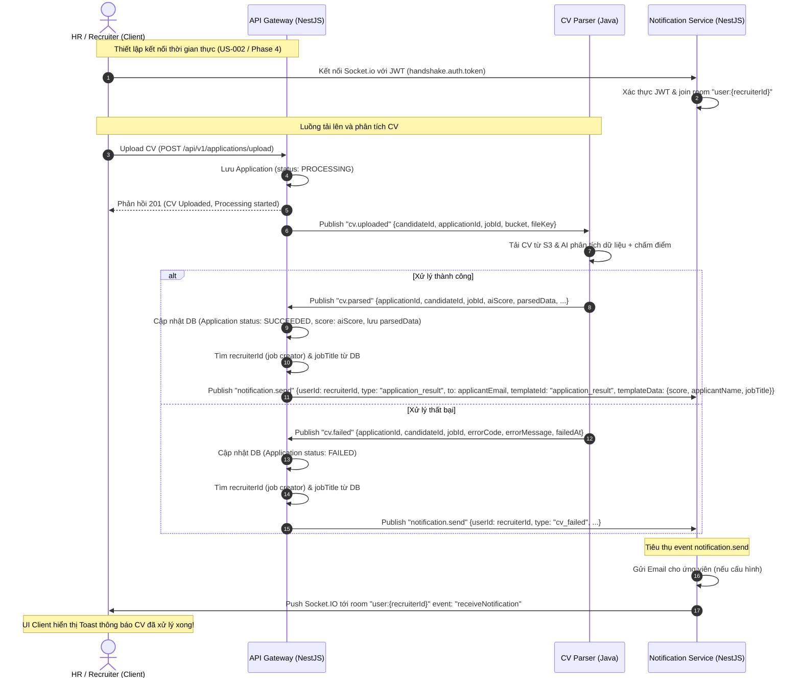

# Tài liệu Thiết kế & Giao ước Sự kiện (Event Contract): CV Parsing Notifications

**Mục tiêu**: Định hình lại luồng giao tiếp dữ liệu bất đồng bộ (event-driven workflow) cho các sự kiện phân tích CV (`cv.parsed` và `cv.failed`). Thiết kế này giải quyết lỗ hổng cấu trúc dữ liệu hiện tại, tích hợp Socket.IO (liên kết đến **Phase 4 - Socket.IO Real-time** và **User Story US-002**) để push notification thời gian thực tới HR/Recruiter khi CV của ứng viên được phân tích và chấm điểm thành công hoặc thất bại.

---

## 1. Kiến trúc luồng xử lý (Workflow Architecture)

Do `cv-parser` (Java) chạy nền cô lập, nó không thể truy cập trực tiếp Postgres DB của `api-gateway` và không biết thông tin người dùng (HR/Recruiter) nào đã tải CV lên, cũng như tiêu đề công việc (`jobTitle`).

Do đó, chúng ta áp dụng **phương án điều phối trung gian qua `api-gateway`**:
1. `cv-parser` hoàn thành phân tích và gửi sự kiện thô kèm ID (`applicationId`, `jobId`, `candidateId`, `aiScore`/`errorMessage`).
2. `api-gateway` tiêu thụ các sự kiện thô này, cập nhật database, truy vấn thông tin HR (`recruiterId`) và `jobTitle`.
3. `api-gateway` phát một sự kiện giàu thông tin (`notification.send`) sang cho `notification` service.
4. `notification` service vừa gửi email cho ứng viên (nếu cần), vừa đẩy thông báo qua Socket.IO phòng `user:{recruiterId}` cho HR đang trực tuyến.

### Sơ đồ luồng (Workflow Sequence Diagram)



---

## 2. Chi tiết Giao ước Dữ liệu (Contract Specification)

### 2.1. Sự kiện `cv.parsed` (Publisher: `cv-parser` -> Consumer: `api-gateway`)
Sự kiện phát đi từ Java worker sau khi phân tích thành công.

*   **Routing Key**: `cv.parsed`
*   **Exchange**: `talentflow.events` (Topic)
*   **Payload Schema (JSON)**:
```json
{
  "candidateId": "9b1deb4d-3b7d-4bad-9bdd-2b0d7b3dcb6d",
  "applicationId": "1a2b3c4d-5e6f-7a8b-9c0d-1e2f3a4b5c6d",
  "jobId": "f47ac10b-58cc-4372-a567-0e02b2c3d479",
  "aiScore": 85,
  "parsedData": {
    "fullName": "Nguyễn Văn A",
    "email": "nguyenvana@example.com",
    "phone": "+84900000000",
    "linkedIn": "https://linkedin.com/in/nguyenvana",
    "summary": "Experienced Node.js Developer...",
    "skills": ["Node.js", "TypeScript", "NestJS", "PostgreSQL"],
    "experience": [
      {
        "title": "Senior Developer",
        "company": "Tech Corp",
        "startDate": "2024-01",
        "endDate": null,
        "description": "Building microservices..."
      }
    ],
    "education": [
      {
        "degree": "Bachelor of IT",
        "institution": "University of Technology",
        "graduationYear": "2023"
      }
    ]
  },
  "scoringReasoning": "Strong match in NestJS and Postgres database design.",
  "parsedAt": "2026-06-16T14:30:00Z"
}
```

---

### 2.2. Sự kiện `cv.failed` (Publisher: `cv-parser` -> Consumer: `api-gateway`)
Sự kiện phát đi khi phân tích thất bại (định dạng file không hỗ trợ, lỗi trích xuất AI, v.v.).

*   **Routing Key**: `cv.failed`
*   **Exchange**: `talentflow.events` (Topic)
*   **Payload Schema (JSON)**:
```json
{
  "candidateId": "9b1deb4d-3b7d-4bad-9bdd-2b0d7b3dcb6d",
  "applicationId": "1a2b3c4d-5e6f-7a8b-9c0d-1e2f3a4b5c6d",
  "jobId": "f47ac10b-58cc-4372-a567-0e02b2c3d479",
  "errorCode": "EXTRACTION_FAILED",
  "errorMessage": "Unable to extract text from the provided CV document.",
  "retryable": false,
  "failedAt": "2026-06-16T14:31:00Z"
}
```

---

### 2.3. Sự kiện `notification.send` (Publisher: `api-gateway` -> Consumer: `notification`)
Sự kiện làm giàu thông tin (Enriched Event) được phát đi từ `api-gateway` sau khi xử lý thành công hoặc lỗi từ CV Parser. Dịch vụ thông báo sử dụng event này để đẩy qua cả hai kênh: **Email** và **WebSocket/Socket.IO**.

*   **Routing Key**: `notification.send`
*   **Exchange**: `talentflow.events` (Topic)
*   **Payload Schema cho SUCCESS (JSON)**:
```json
{
  "userId": "uuid-cua-recruiter-nhan-push-notification",
  "to": "nguyenvana@example.com",
  "subject": "CV Processed: Kỹ sư Node.js",
  "type": "application_result",
  "templateId": "application-result",
  "templateData": {
    "applicantName": "Nguyễn Văn A",
    "jobTitle": "Kỹ sư Node.js",
    "score": 85
  }
}
```

*   **Payload Schema cho FAILURE (JSON)**:
```json
{
  "userId": "uuid-cua-recruiter-nhan-push-notification",
  "to": "nguyenvana@example.com",
  "subject": "CV Processing Failed: Kỹ sư Node.js",
  "type": "cv_failed",
  "body": "Chúng tôi không thể xử lý CV của Nguyễn Văn A cho vị trí Kỹ sư Node.js. Lý do: Unable to extract text."
}
```

---

## 3. Kế hoạch triển khai mã nguồn (Implementation Plan)

### Bước 1: Điều chỉnh cấu trúc lớp Tiêu thụ tin nhắn trong dịch vụ `notification`
1. Cấu hình lại `CvParsedDto` và `CvFailedDto` trong `notification` để khớp trực tiếp với payload từ `cv-parser` (nếu cần tương thích ngược) hoặc để `api-gateway` làm trung gian đón trước toàn bộ.
2. Vì ta chọn **phương án trung gian qua api-gateway**, dịch vụ `notification` sẽ **HỦY BỎ** việc lắng nghe trực tiếp `cv.parsed` và `cv.failed` từ `cv-parser`. Hàng đợi `notification.events` sẽ chỉ bind với:
   - `workspace.member.invited`
   - `application.created`
   - `notification.send` (Event này đại diện cho cả việc gửi mail và đẩy push socket)
3. Cập nhật `notification.service.ts` để khi xử lý event `notification.send`:
   - Bước 1: Gửi email cho đối tượng `to` (sử dụng SMTP).
   - Bước 2: Đẩy Socket.IO qua `NotificationGateway.sendToUser(event.userId, 'receiveNotification', event)`.

### Bước 2: Triển khai Consumer RabbitMQ ở `api-gateway`
1. Đăng ký hàng đợi đón nhận sự kiện `cv.parsed` và `cv.failed`.
2. Tạo Service Listener trong `api-gateway/src/queue/` để tiêu thụ các event này:
   - Khi có `cv.parsed`: Cập nhật `application` với trạng thái `SUCCEEDED` và `aiScore`. Thực hiện lưu trữ `parsedData` vào DB. Tìm `recruiterId` của job, sau đó phát event `notification.send` sang cho `notification` service.
   - Khi có `cv.failed`: Cập nhật `application` với trạng thái `FAILED`. Tìm `recruiterId` của job, sau đó phát event `notification.send` sang cho `notification` service.
