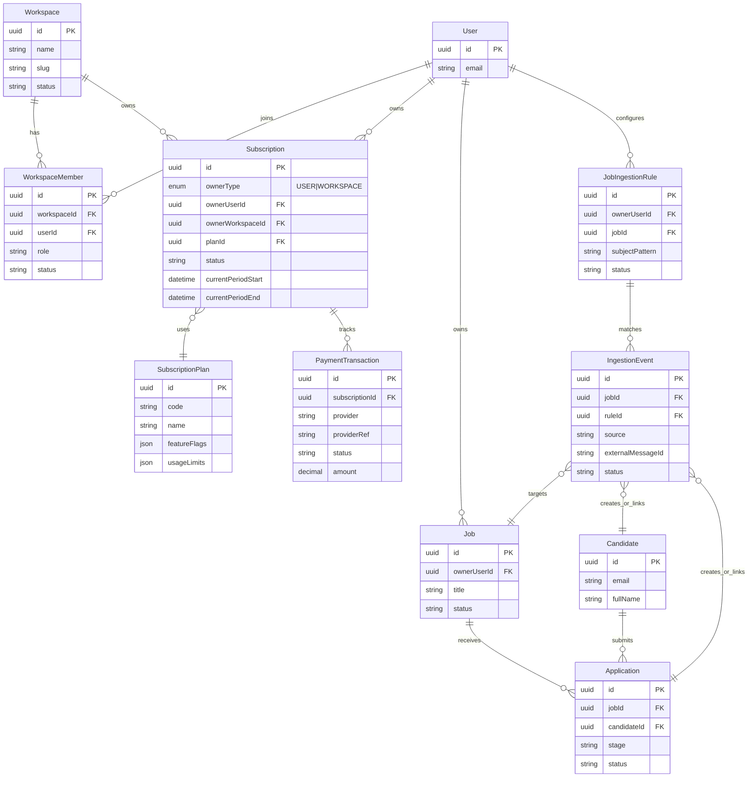
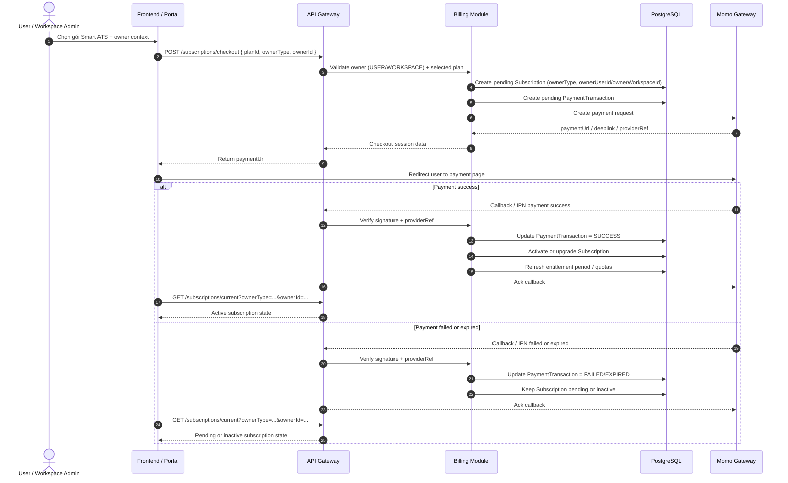
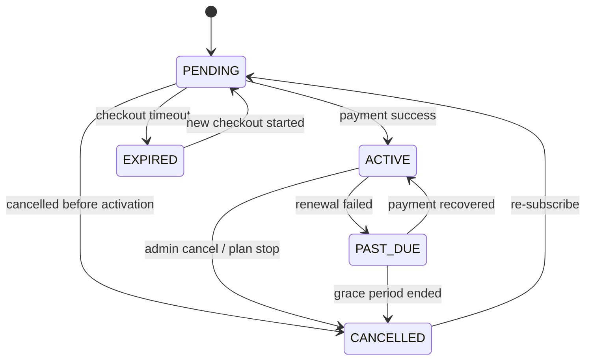
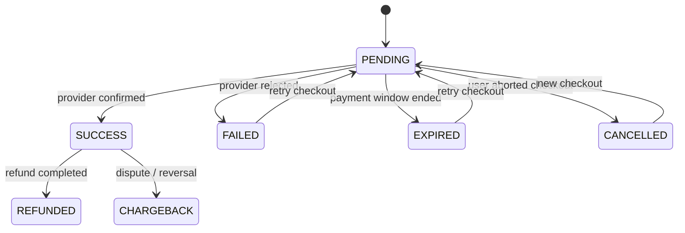

# Smart ATS Expansion

**Project:** TalentFlow AI Backend  
**Scope:** Post-MVP expansion direction  
**Status:** Planned direction for team onboarding and task assignment  
**Payment Gateway Direction:** Momo is the planned primary payment gateway  
**Last Updated:** 2026-04-05

---

## Purpose

Tài liệu này tổng hợp định hướng mở rộng Smart ATS sau MVP để thành viên mới có thể nắm nhanh:

- bài toán sản phẩm đang mở rộng
- các module mới cần tách ra
- những gì có thể tái sử dụng từ hệ thống hiện tại
- các quyết định đã chốt và các điểm vẫn đang mở

---

## What is being added

### 1. Subscription / Package Registration

Hệ thống sẽ được mở rộng theo hướng subscription owner polymorphic cho Smart ATS.

Mục tiêu:

- cho phép đăng ký gói dịch vụ
- tích hợp thanh toán
- kiểm soát entitlement theo từng gói
- dùng một bảng `Subscription` chung với owner:
  - `ownerType = USER | WORKSPACE`
  - `ownerUserId` nullable
  - `ownerWorkspaceId` nullable
- hỗ trợ cả personal billing (USER) và workspace billing (WORKSPACE)

### 2. Gmail + n8n CV Ingestion

*Tài liệu kiến trúc và lộ trình thực tế:* [email-ingestion-automation.md](docs/expansion/email-ingestion-automation.md)

Hệ thống sẽ hỗ trợ tự động lấy CV từ Gmail theo subject pattern gắn với JD, ví dụ:

- `[Java-Backend]`
- `[Frontend-ReactJs]`

Luồng mong muốn (Được chia làm 2 Pha để tối ưu tốc độ ship MVP và phân bổ nhân sự):

**Pha 1 (MVP):**
1. Gmail nhận email ứng viên.
2. n8n lắng nghe, tải attachment PDF/DOCX.
3. n8n thực hiện Email Parsing đơn giản (trích xuất email, tên ứng viên, body làm cover letter) và tự động phân tích tiêu đề (Subject) để phân loại `jobId`.
4. n8n gọi API Gateway qua route `/api/v1/applications/ingestion`.
5. API Gateway validate API Key/JobId, tạo Candidate/Application, upload file lên R2 và publish `cv.uploaded`.
6. CV Parser (Spring Boot) thực hiện parse nội dung CV và chấm điểm.

**Pha 2 (Maintain & Scale - Tích hợp .NET Engine):**
1. Gmail nhận email ứng viên.
2. n8n forward email thô và file đính kèm sang **.NET Ingestion Engine**.
3. **.NET Ingestion Engine** chạy thuật toán so khớp Job (Priority & Specificity Matching) và check trùng file (Deduplicate).
4. .NET Engine gọi API Gateway qua `/api/v1/applications/ingestion`.
5. API Gateway xử lý lưu trữ và tiếp tục pipeline như Pha 1.
6. CV Parser (Spring Boot) xử lý tiếp.

---

## Domain & Schema Snapshot

Tài liệu hiện tại dùng hướng nhìn `Workspace-first cho billing/membership` và `Job-owner-first cho ATS core` để giúp team thiết kế module enterprise nhất quán, dù schema production cuối cùng vẫn chưa chốt hoàn toàn.

### Domain notes

- `Workspace` là chủ thể enterprise chính cho membership/collaboration.
- `Job` không có relationship trực tiếp/gián tiếp với `Workspace`; ownership của `Job` thuộc user domain.
- `Subscription` dùng owner polymorphic: `ownerType=USER|WORKSPACE`, `ownerUserId` nullable, `ownerWorkspaceId` nullable.
- `SubscriptionPlan` định nghĩa feature flags và quota, còn `Subscription` là gói đang active theo owner (`USER` hoặc `WORKSPACE`).
- `PaymentTransaction` theo dõi vòng đời thanh toán qua Momo và các trạng thái callback/reconciliation.
- `JobIngestionRule` map subject tag hoặc email pattern sang `Job` theo owner domain (không suy diễn theo workspace).
- `IngestionEvent` phục vụ audit trail, duplicate detection và retry tracking cho n8n/Gmail ingestion.
- `Job`, `Application`, `Candidate` vẫn là ATS core entities và được nối vào domain mới thay vì bị thay thế.

---

## Momo Payment Flow Snapshot

Mục tiêu của flow này là mô tả một vòng đời thanh toán tối thiểu cho gói Smart ATS theo hướng owner polymorphic (`USER`/`WORKSPACE`).

### Payment flow notes

- `Subscription` nên được tạo ở trạng thái `PENDING` trước khi redirect sang Momo và phải lưu owner context (`ownerType`, `ownerUserId`/`ownerWorkspaceId`).
- `PaymentTransaction` là nguồn sự thật cho trạng thái giao dịch với provider.
- callback/IPN từ Momo phải được verify chữ ký trước khi update dữ liệu.
- activation entitlement chỉ nên xảy ra sau khi giao dịch được xác nhận thành công.
- cần hỗ trợ các trạng thái `PENDING`, `SUCCESS`, `FAILED`, `EXPIRED`, và khả năng reconciliation nếu callback đến trễ hoặc bị retry.

---

## Billing State Machine Snapshot

### Subscription lifecycle

### PaymentTransaction lifecycle

### State machine notes

- `Subscription` và `PaymentTransaction` không nên dùng chung một status enum vì semantics khác nhau.
- `Subscription` phản ánh quyền sử dụng dịch vụ theo owner (`USER` hoặc `WORKSPACE`).
- `PaymentTransaction` phản ánh trạng thái giao dịch với Momo hoặc payment provider.
- `Subscription = ACTIVE` chỉ nên xảy ra khi có một giao dịch hợp lệ được xác nhận thành công.
- các transition từ callback phải idempotent để tránh double-processing khi provider retry.
- nếu có gia hạn gói, nên cân nhắc tạo transaction mới thay vì overwrite transaction cũ để giữ audit trail đầy đủ.

---

## Reuse strategy

Không xây mới pipeline CV.

Các thành phần hiện có cần tái sử dụng:

- `api-gateway/src/applications/applications.service.ts`
- `api-gateway/src/storage/storage.service.ts`
- `api-gateway/src/queue/queue.service.ts`
- `api-gateway/src/queue/constants/queue.constants.ts`
- `api-gateway/src/jobs/jobs.service.ts`
- `api-gateway/prisma/schema.prisma`

Nguyên tắc:

- API Gateway vẫn là nơi giữ validation và business rules
- n8n chỉ đóng vai trò automation input
- không cho n8n ghi DB trực tiếp
- không cho n8n publish queue trực tiếp ở phase đầu

---

## Recommended implementation phases

### Phase 1 — Automation / Ingestion

Module mới cho Gmail + n8n ingestion.

Dự kiến gồm:

- ingestion controller / endpoint
- source authentication cho n8n
- subject-tag to job mapping
- duplicate prevention / idempotency
- upload + application creation + queue publish

### Phase 2 — Billing / Subscription / Payment

Module mới cho package registration và thanh toán.

Dự kiến gồm:

- plan catalog
- subscription lifecycle
- payment transaction tracking
- Momo integration

### Phase 3 — Entitlement / Feature Gating

Kiểm soát tính năng theo gói.

Ví dụ:

- số lượng JD đang hoạt động
- số lượng CV được parse mỗi kỳ
- bật/tắt Gmail automation
- các tính năng Smart ATS nâng cao
- số lượng member cùng tham gia workspace/board

---

## Architecture direction

### Confirmed

- Đây là bài toán enterprise nhưng vẫn hỗ trợ personal billing.
- Billing owner dùng mô hình polymorphic: `ownerType = USER | WORKSPACE`.
- Các gói cao sẽ cần nhiều HR/Recruiter cùng tham gia vào một board/workspace.
- Momo là payment gateway ưu tiên hiện tại trong tài liệu.

### Still open

- Chính sách migration giữa subscription owner `USER` -> `WORKSPACE` khi khách hàng nâng cấp mô hình tổ chức.
- Quy tắc giới hạn plan nào được phép dùng owner `USER` hoặc `WORKSPACE` ở từng môi trường.

Điều này có nghĩa là:

- subscription được resolve theo `(ownerType, ownerId)`
- entitlement được kiểm tra theo owner context thay vì mặc định workspace-only
- user có thể là personal owner hoặc workspace member tùy use case

---

## Planned modules for team assignment

### A. Automation / Ingestion Module

**Boundary:** xử lý inbound automation từ Gmail/n8n đến trước thời điểm ATS core pipeline tiếp tục qua `cv.uploaded`.

**Phụ trách:**

- endpoint cho n8n
- file validation
- subject mapping
- duplicate protection
- integration với application + queue flow hiện có

**Owns mainly:**

- `JobIngestionRule`
- `IngestionEvent`
- protected ingestion API contract
- source authentication cho automation calls

**Suggested ownership:** 1 backend member tập trung vào API Gateway integration và event-safe ingestion.

### B. Billing / Payment Module

**Boundary:** quản lý catalogue gói, lifecycle subscription và payment state, nhưng không trực tiếp chứa ATS recruitment logic.

**Phụ trách:**

- package definitions
- subscription lifecycle
- payment status
- Momo callback / reconciliation flow

**Owns mainly:**

- `SubscriptionPlan`
- `Subscription`
- `PaymentTransaction`
- payment provider adapter / webhook handling

**Suggested ownership:** 1 backend member tập trung vào payment flow, callback handling và trạng thái giao dịch.

### C. Workspace / Membership Module

**Boundary:** quản lý chủ thể enterprise dùng chung board/workspace và member collaboration.

**Phụ trách:**

- workspace entity
- member invites / roles
- recruiter collaboration trong cùng board

**Owns mainly:**

- `Workspace`
- `WorkspaceMember`
- workspace-level access model
- future organization/membership rules

**Suggested ownership:** 1 backend member tập trung vào access model và enterprise collaboration structure.

### D. Entitlement Module

**Boundary:** đọc plan/subscription state theo owner context (`USER`/`WORKSPACE`) để quyết định owner có được dùng tính năng nào và quota còn lại bao nhiêu.

**Phụ trách:**

- kiểm tra quyền theo plan
- usage quotas
- gating ở job creation, ingestion, parsing, automation

**Owns mainly:**

- entitlement evaluation rules
- usage counters / quota policy
- service-level checks hoặc guards cho feature gating

**Suggested ownership:** có thể đi cùng người làm Billing nếu team nhỏ; nếu team lớn hơn thì tách riêng cho 1 member để giảm coupling.

## Module boundaries summary

- **Automation/Ingestion** chịu trách nhiệm đưa dữ liệu từ Gmail/n8n vào hệ thống một cách an toàn.
- **Billing/Payment** chịu trách nhiệm xử lý tiền và trạng thái subscription.
- **Workspace/Membership** chịu trách nhiệm mô hình cộng tác enterprise nhiều recruiter trên cùng board.
- **Entitlement** chịu trách nhiệm quyết định owner hiện tại (`USER`/`WORKSPACE`) được làm gì dựa trên plan đang active.

Nguyên tắc chia ranh giới:

- không nhét payment logic vào auth guard chung
- không để n8n bypass business rules của API Gateway
- không để entitlement rules rải rác khắp codebase mà không có một lớp kiểm tra thống nhất

---

## Biggest risks

1. **Workspace model chưa được chốt hoàn toàn**
   - ảnh hưởng trực tiếp tới schema billing và entitlement.

2. **Subject mapping có thể sai job**
   - cần rule rõ ràng và audit trail.

3. **Duplicate ingestion do retry từ Gmail/n8n**
   - cần idempotency key và event tracking.

4. **Security boundary cho inbound endpoint**
   - phải validate file type, size, source auth và không tin metadata từ bên ngoài.

5. **Payment lifecycle complexity**
   - callback, pending state, failed state, reconciliation, subscription activation cần được mô tả rõ.

---

## Task Breakdown & Execution Order

Task breakdown chi tiết đã được tách sang file riêng để team có thể dùng như checklist khi assign và theo dõi tiến độ:

- [SMART_ATS_TASK_BREAKDOWN.md](./SMART_ATS_TASK_BREAKDOWN.md)

File này bao gồm:

- checklist theo phase
- dependency giữa các task
- suggested assignment by member
- suggested execution order
- ready-to-drop first wave

---

## Related docs

- [TEAM_DECISIONS.md](./TEAM_DECISIONS.md)
- [PROJECT_SUMMARY.md](./PROJECT_SUMMARY.md)
- [API_REFERENCE.md](./API_REFERENCE.md)
- [DATABASE_SCHEMA.md](./DATABASE_SCHEMA.md)
- [SRS.md](./SRS.md)
